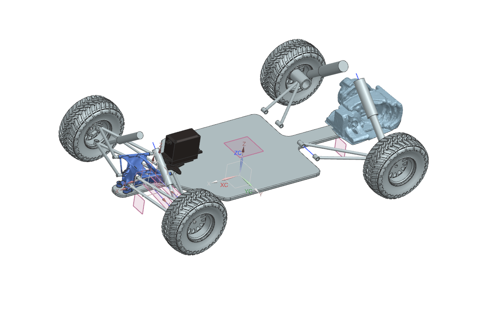

# RC CAR CAD 1.0

This repository contains engineering data for a remote control car design. This data includes CAD, CAE, BOM and any other data used to design the vehicle. Each release in the repo represents a milestone in the design process. 

Release 1.0 is the milestone where the car can be exported to NVIDIA omniverse and the vehicle suspension and steering can be rigged using physics joints.

The purpose of this data set is to give anyone working with NVIDIA omniverse production-quality CAD data to work with as they develop Omniverse applications, extensions, and/or microservices. This data may also be used for demonstrations, tutorials, engineering design process research, or however else it is needed. 

The data is being released in design phases so that it represents not just a finished product, but also an in-process product throughout its design. In this way the data can be used to facilitate in-process design workflows.

The assembly is modeled using NX. To open the full assembly open "_Class1RC.prt". Subassemblies are in corresponding subfolders. A bill of materials with assembly and part descriptions can be found in "BOM.xlsx".